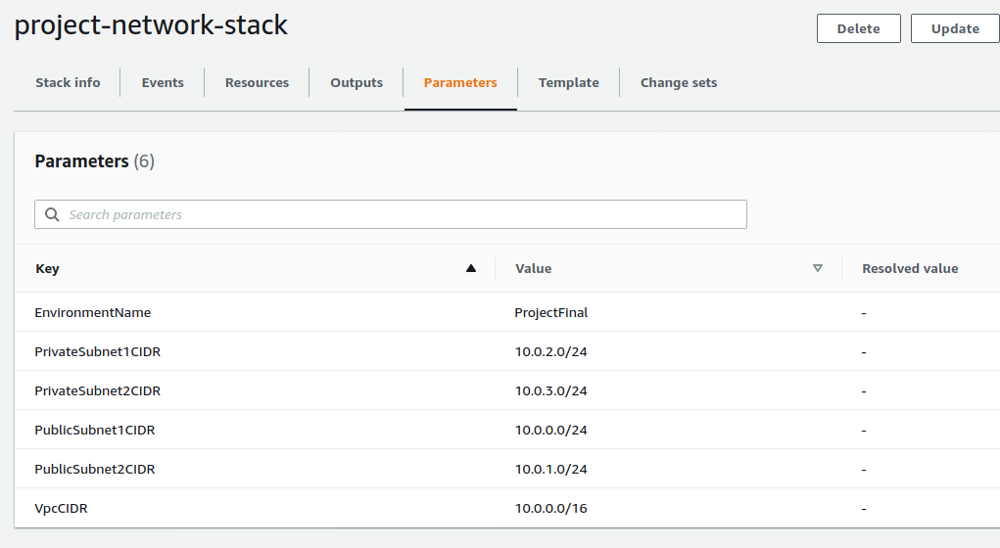
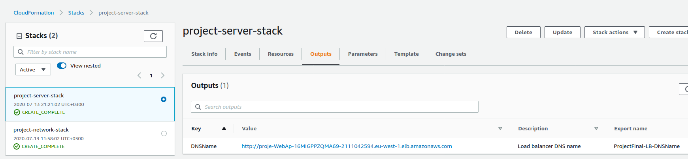

# Udacity AWS CloudFormation Project 2

# Basics

## Parameters
###   projectinfra-network-params.yaml




## DNS URL


link to Udagram  http://proje-WebAp-16MIGPPZQMA69-2111042594.eu-west-1.elb.amazonaws.com

# Load Balancer


- [x] Target Group (in projectinfra-servers.yaml)
- [x] Health Check and Listener  (in projectinfra-servers.yaml)

# Auto-Scaling

- [x] Auto-scaling instances in Private Subnets  (in projectinfra-servers.yaml)
- [x] Machine Specs met  (in projectinfra-servers.yaml)
- [x] No keyname property  (in projectinfra-servers.yaml)

# Finally to deploy the stack

```
./create.sh project-network-stack projectinfra-network.yaml projectinfra-network-params.json
./create.sh project-server-stack projectinfra-servers.yaml projectinfra-servers-params.json
```
